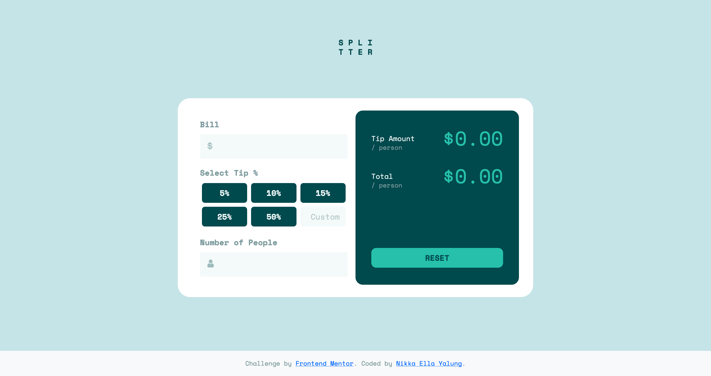

# Frontend Mentor - Tip calculator app solution

This is a solution to the [Tip calculator app challenge on Frontend Mentor](https://www.frontendmentor.io/challenges/tip-calculator-app-ugJNGbJUX). Frontend Mentor challenges help me improve my coding skills by building realistic projects.

## Table of contents

- [Overview](#overview)
  - [The challenge](#the-challenge)
  - [Screenshot](#screenshot)
  - [Links](#links)
- [My process](#my-process)
  - [Built with](#built-with)
  - [Continued development](#continued-development)
- [Author](#author)

## Overview

### The challenge

Users should be able to:

- View the optimal layout for the app depending on their device's screen size
- See hover states for all interactive elements on the page
- Calculate the correct tip and total cost of the bill per person

### Screenshot

### Links

- [Solution URL](https://github.com/nikkaella/tip-calc)
- [Live Site URL](https://nikkaella.github.io/tip-calc/)

## My process

I started with organizing the HTML file, then css, then js!

### Built with

- Semantic HTML5 markup
- CSS custom properties
- Flexbox 
- Bootstrap
- Mobile-first workflow
- JavaScript
- JQuery

### Continued development

I'd like to continue focusing on javascript and jquery. Additionally, the application of bootstrap and flex can also use some more work. I'd like to also continue working on form validation and accessibility.

## Author

- Website - [Nikka Ella Yalung](https://nikkaellayalung.com)
- LinkedIn - [Nikka Ella Yalung](https://www.linkedin.com/in/nikka-yalung/)
- Github - [@nikkaella](https://github.com/nikkaella)
